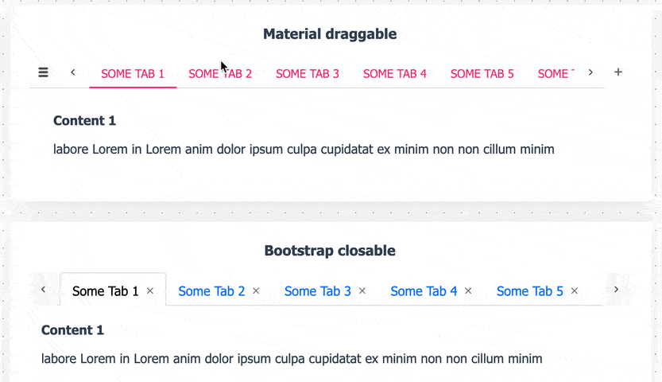

# react-tabtab-next

[](https://www.npmjs.com/package/@react-tabtab-next/tabtab)
[](https://www.npmjs.com/package/@react-tabtab-next/tabtab)
[](https://www.npmjs.com/package/@react-tabtab-next/tabtab)

## A mobile support, draggable, editable and api based Tab for ReactJS

**(!) This lib based on [react-tabtab](https://github.com/ctxhou/react-tabtab) but refactored using Typescript and replacing some deprecated libs**


### [Demo Playground](https://codesandbox.io/s/react-tabtab-next-yk4moo)

<p style="text-align: center;" align="center">
    
</p>

for build a local playground run

```bash
npm run demo
```

and go to http://127.0.0.1:9000

also here Codesandbox [playground](https://codesandbox.io/s/react-tabtab-next-yk4moo)

## Features

-   **Mobile supported** — Touch support. Easy to use on mobile device
-   **Draggable tab** — Support drag and drop tab
-   **Add & Delete** — Tab can be added and deleted
-   **Async content** — Lazy load panel content
-   **Customizable style** — Based on `styled-components`, super easy to customize tab style
-   **API based** — All actions are controllable
-   **ARIA accessible**

## Table of Contents

<!-- toc -->

-   [Installation](#installation)
-   [Usage](#usage)
    -   [Minimal setup](#minimal-setup)
    -   [Draggable tab](#draggable-tab)
    -   [Async Panel](#async-panel)
    -   [Another Examples](#another-examples)
-   [Components / Api](#components--api)
    -   [&lt;Tabs /&gt;](#lttabs-gt)
    -   [&lt;TabList /&gt;](#lttablist-gt)
    -   [&lt;Tab /&gt;](#lttab-gt)
    -   [&lt;DragTabList /&gt;](#ltdragtablist-gt)
    -   [&lt;PanelList/ &gt;](#ltpanellist-gt)
    -   [&lt;Panel /&gt;](#ltpanel-gt)
    -   [&lt;AsyncPanel /&gt;](#ltasyncpanel-gt)
-   [Customize style](#customize-style)
-   [Development](#development)
-   [License](#license)

<!-- tocstop -->

## Installation

Install it with npm or yarn

```sh
npm install @react-tabtab-next/tabtab --save
```

Then, import the module by module bundler like `webpack`, `browserify`

```js
// es6
import { Tabs, DragTabList, PanelList, Panel, ExtraButton } from '@react-tabtab-next/tabtab';

// not using es6
var Tabtab = require('react-tabtab');
var Tabs = Tabtab.Tabs;
```

## Usage

React-tabtab is a tab component with highly customization. You can create a tab in simply setting. You also can create a tab system full with `draggable`, `async loading`, `close and create button`.
All the actions are api based. It means there is `no state` in the component. Developers have full control.

### Minimal setup

```js
import React, { Component } from 'react';
import ReactDOM from 'react-dom';
import { Tabs, TabList, Tab, PanelList, Panel } from '@react-tabtab-next/tabtab';

class Basic extends Component {
    render() {
        return (
            <Tabs>
                <TabList>
                    <Tab>Tab1</Tab>
                    <Tab>Tab2</Tab>
                </TabList>
                <PanelList>
                    <Panel>Content1</Panel>
                    <Panel>Content2</Panel>
                </PanelList>
            </Tabs>
        );
    }
}

ReactDOM.render(<Basic />, document.getElementById('root'));
```

It's simple to use. Zero configuration!

### Draggable tab

```js
import React, { Component } from 'react';
import { Tabs, DragTabList, PanelList, Panel, helpers } from '@react-tabtab-next/tabtab';

const makeData = (number, titlePrefix = 'Tab') => {
    const data = [];
    for (let i = 0; i < number; i++) {
        data.push({
            title: `${titlePrefix} ${i}`,
            content: <div>Content {i}</div>,
        });
    }
    return data;
};

export default class Drag extends Component {
    constructor(props) {
        super(props);
        this.handleTabChange = this.handleTabChange.bind(this);
        this.handleTabSequenceChange = this.handleTabSequenceChange.bind(this);
        const tabs = makeData(10, 'Some Tab');
        this.state = {
            activeIndex: 0,
            tabs,
        };
    }

    handleTabChange(index) {
        this.setState({ activeIndex: index });
    }

    handleTabSequenceChange({ oldIndex, newIndex }) {
        const { tabs } = this.state;
        const updateTabs = helpers.simpleSwitch(tabs, oldIndex, newIndex);
        this.setState({ tabs: updateTabs, activeIndex: newIndex });
    }

    render() {
        const { tabs, activeIndex } = this.state;
        const tabsTemplate = [];
        const panelTemplate = [];
        tabs.forEach((tab, index) => {
            tabsTemplate.push(<DragTab key={index}>{tab.title}</DragTab>);
            panelTemplate.push(<Panel key={index}>{tab.content}</Panel>);
        });
        return (
            <Tabs
                activeIndex={activeIndex}
                onTabChange={this.handleTabChange}
                onTabSequenceChange={this.handleTabSequenceChange}
                customStyle={this.props.customStyle}
            >
                <DragTabList>{tabsTemplate}</DragTabList>
                <PanelList>{panelTemplate}</PanelList>
            </Tabs>
        );
    }
}

ReactDOM.render(<Drag />, document.getElementById('root'));
```

Based on above example, the different to implement `normal tab` or `drag tab` is using different wrapper and child.

And all the actions are controllable. You can customize your switch action. But if you don't want to write customized switch logic, you can directly use `import {simpleSwitch} from 'react-tabtab/lib/helpers/move'` this built-in function.

**normal tab**

```js
<Tabs>
    <TabList>
        <Tab>Tab1</Tab>
        <Tab>Tab2</Tab>
    </TabList>
    <PanelList>
        <Panel>Content1</Panel>
        <Panel>Content2</Panel>
    </PanelList>
</Tabs>
```

**Sortable tabs**

```js
<Tabs
    // customStyle={md}
    // activeIndex={activeTab}
    // onTabChange={handleOnTabChange}
    // onTabSequenceChange={handleOnTabSequenceChange}
    ExtraButton={
        <ExtraButton
            onClick={(e) => {
                console.log(e);
            }}
        >
            +
        </ExtraButton>
    }
>
    <DragTabList>
        <Tab>Tab1</Tab>
        <Tab>Tab2</Tab>
    </DragTabList>
    <PanelList>
        <Panel>Content1</Panel>
        <Panel>Content2</Panel>
    </PanelList>
</Tabs>
```

### Async Panel

In some case, if the data is large or we want to save the bandwidth, lazy loading the content is possible solution. You can use `AsyncPanel` to laze load panel content.
Moreover, you can mix lazy load panel with normal panel!

```js
import React, { Component } from 'react';
import ReactDOM from 'react-dom';
import { Tabs, TabList, Tab, PanelList, AsyncPanel, Panel } from '@react-tabtab-next/tabtab';

function loadContentFunc(callback) {
    setTimeout(() => {
        callback(null, 'some content');
    }, 1000);
}

// You also can provide promise as return function:
// function loadContentFunc() {
//   return fetch('/products')
//     .then(resp => resp.json())
//     .then(data => data);
// }

class AsyncTab extends Component {
    render() {
        return (
            <Tabs>
                <TabList>
                    <Tab>Tab1</Tab>
                    <Tab>Tab2</Tab>
                </TabList>
                <PanelList>
                    <Panel>Content1</Panel>
                    <AsyncPanel
                        loadContent={loadContentFunc}
                        render={(data) => <div>{JSON.stringify(data)}</div>}
                        renderLoading={() => <div>Loading...</div>}
                        cache={true}
                    />
                </PanelList>
            </Tabs>
        );
    }
}

ReactDOM.render(<AsyncTab />, document.getElementById('root'));
```

To implement lazy loading, use `AsyncPanel` to wrap your panel content. Remember to provide `loadContent`, `render`, `renderLoading` these 3 props.

In `loadContent` props, both `callback` and `promise` type are supported.

If you use `callback`, remember to call `callback` when finish async loading.

If you use `promise`, need to return promise action.

When data is loading, the panel content will show `renderLoading` component.

After finishing loading data, the panel content will show `render` component and react-tabtab will pass the `loadContent` result as first parameter. So you can customize the component of panel content.

### Another Examples

More code examples are avalable [here](https://github.com/onmotion/react-tabtab-next/blob/master/demo/src/App.tsx).

## Components / Api

### &lt;Tabs /&gt;

`<Tabs/>` is the main component of `react-tabtab`. Most of the api is passed from it.

<table>
  <tbody>
    <tr>
      <th>props</th>
      <th>type</th>
      <th>default</th>
      <th></th>
    </tr>
    <tr>
      <td>activeIndex</td>
      <td><code>number</code></td>
      <td>null</td>
      <td>control current activeIndex.<br/>You need to pass new activeIndex value if you want to show different tab.</td>
    </tr>
    <tr>
      <td>defaultIndex</td>
      <td><code>number</code></td>
      <td>0</td>
      <td>default selected index if active index is not provided</td>
    </tr>
    <tr>
      <td>showModalButton</td>
      <td><code>boolean</code><br/><code>number</code></td>
      <td>4</td>
      <td>
        <ul>
          <li><b>true</b>: always show button</li>
          <li><b>false</b>: always hide button</li>
          <li><b>[number]</b>: when <code>number of tab >= [number]</code>, show button</li>
        </ul>
      </td>
    </tr>
    <tr>
      <td>showArrowButton</td>
      <td><code>auto</code><br/><code>boolean</code></td>
      <td>auto</td>
      <td>
        <li><b>auto</b>: detect tab width, if they exceed container, show button</li>
        <li><b>true</b>: always show button</li>
        <li><b>false</b>: always hide button</li>
      </td>
    </tr>
    <tr>
      <td>ExtraButton</td>
      <td><code>React Node</code></td>
      <td>null</td>
      <td>
        customize extra button content, example: `+` button
      </td>
    </tr>
    <tr>
      <td>onTabChange</td>
      <td><code>(tabIndex) => {}</code></td>
      <td>null</td>
      <td>
        return tabIndex is clicked<br/>
        You can use this api with <code>activeIndex</code>. When user click tab, update <code>activeIndex</code>.
      </td>
    </tr>
    <tr>
      <td>onTabSequenceChange</td>
      <td><code>(oldIndex, newIndex) => {}</code></td>
      <td>null</td>
      <td>
        return changed oldIndex and newIndex value<br/>
        With this api, you can do switch tab very easily.
        <b>Note:<b/>This api is only called by <code>&lt;DragTabList/&gt;</code>
      </td>
    </tr>
    <tr>
      <td>onTabClose</td>
      <td><code>(index) => {}</code></td>
      <td>null</td>
      <td>
        When user click <b>close button</b> , this api will return the clicked close button index.
      </td>
    </tr>
    <tr>
      <td>customStyle</td>
      <td>
        <pre>
<code>{
  TabList: React.Element,
  Tab: React.Element,
  Panel: React.Element,
  ActionButton: React.Element
}</code></pre>
      </td>
      <td> theme</td>
      <td>
        customized tab style component
      </td>
    </tr>
  </tbody>
</table>

### &lt;TabList /&gt;

Use to wrap `<Tab/>`.

### &lt;DragTabList /&gt;

Use to wrap `<Tab/>`.

### &lt;Tab /&gt;

Normal Tab. Show the children component on tab.

<table>
  <tbody>
    <tr>
      <th>props</th>
      <th>type</th>
      <th>default</th>
      <th></th>
    </tr>
    <tr>
      <td>closable</td>
      <td><code>boolean</code></td>
      <td>false</td>
      <td>whether to show close button</td>
    </tr>
  </tbody>
</table>

**Example**

```js
<Tab>
    <i className="fa fa-map-pin"></i>
    map tab
</Tab>
```

### &lt;PanelList/ &gt;

Use to wrap `<Panel/>`

### &lt;Panel /&gt;

Tab content.

### &lt;AsyncPanel /&gt;

Lazy loading panel content.

<table>
  <tbody>
    <tr>
      <th>props</th>
      <th>type</th>
      <th>default</th>
      <th></th>
    </tr>
    <tr>
      <td>loadContent <b>*</b></td>
      <td>
        <code>(cb) => cb(error, data)</code> or <br/>
        <code>(cb) => Promise
      </td>
      <td>null</td>
      <td>when loadContent finish, call the callback or you can return promise</td>
    </tr>
    <tr>
      <td>render <b>*</b></td>
      <td>
        <code>(data) => Component</code>
      </td>
      <td>null</td>
      <td>when finish loading data, render this component</td>
    </tr>
    <tr>
      <td>renderLoading <b>*</b></td>
      <td>
        <code>() => Component</code>
      </td>
      <td>null</td>
      <td>when it is loading data, render this component</td>
    </tr>
    <tr>
      <td>cache</td>
      <td>
        <code>boolean</code>
      </td>
      <td>true</td>
      <td>should cache the data</td>
    </tr>
  </tbody>
</table>

## Customize style

`react-tabtab-next` is based on `styled-components`. Therefore, it's super easy to customize the tab style.

Just extend the default component style and pass it to `customStyle` props.

### Use current style

Install tabtab themes

```sh
npm install @react-tabtab-next/themes --save
```

Available themes: `md`, `bootstrap`, `bulma`

For example, if you want to use `material-design`, import the style and pass to `customStyle` props.

**Example:**

```js
import React, { Component } from 'react';
import { Tabs, TabList, Tab, PanelList, Panel } from '@react-tabtab-next/tabtab';
import { md } from '@react-tabtab-next/themes';

export default class Customized extends Component {
    render() {
        return (
            <Tabs customStyle={md}>
                <TabList>
                    <Tab>Tab1</Tab>
                    <Tab>Tab2</Tab>
                </TabList>
                <PanelList>
                    <Panel>Content1</Panel>
                    <Panel>Content2</Panel>
                </PanelList>
            </Tabs>
        );
    }
}
```

And now your tab is material design style!

### Make your own style

If current theme doesn't meet your demand, follow this three steps and create a new one.

**First step: import current style**

```js
import styled from 'styled-components';
import { styled as styledTabTab } from '@react-tabtab-next/tabtab';

let { TabListStyle, ActionButtonStyle, TabStyle, PanelStyle } = styledTabTab;
```

**Second: extend style and export it**

```js
import styled from 'styled-components';
import { styled as themeStyled } from '@react-tabtab-next/tabtab';

let { TabList, ActionButton, Tab, Panel } = themeStyled;

TabList = styled(TabList)`
    background-color: transparent;
    line-height: 1.2;
    border: 0;
`;

Tab = styled(Tab)`
    padding: 1px 10px;
    position: relative;
    font-size: 12px;
    text-transform: uppercase;
    border: 0;
    background: transparent;
    ${(props) => {
        return props.active && !props.vertical
            ? `
      border-bottom: 2px solid #ce93d8;
    `
            : null;
    }}
    &:hover .tab-label_close-button {
        opacity: 1;
    }
    &:hover {
        color: unset;
        background: #89898920;
    }
`;

ActionButton = styled(ActionButton)`
    background-color: transparent;
    border-radius: 0;
    border: none;
    opacity: 0.3;
    transition: opacity 0.2s;
    & svg {
        font-size: 21px;
        padding: 0;
    }
    &:hover {
        opacity: 1;
    }
`;

Panel = styled(Panel)``;

export { TabList, ActionButton, Tab, Panel };
```

**Last: import your style and use it!**

When you finish the new `@react-tabtab-next/theme` style, feel free to add it to `theme/` folder and send PR!

## Development

```bash
npm i
npm run demo
```

or

```bash
yarn install
yarn demo
```

Build the bundle

```bash
npm i
```

## License

MIT
